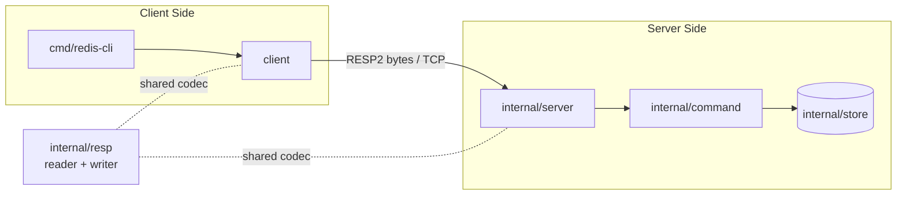

# simple-redis-go — Design & Development Journey

**Author / Lead:** Aswin
**Language:** Go (standard library only)
**Scope:** In-memory Redis-compatible server + client speaking RESP2 over TCP
**Evaluation axes:** Correctness · Simplicity · Testability · Time taken

This document is a transparent engineering log of how I approached, designed, built, hardened, and verified the assignment. It captures the direction I set at each step, the architecture I chose and why, the issues discovered during reviews, and how each was resolved with evidence.

---

## 1. How I Led This

I treated the assignment as a small systems-design problem rather than a scripting task. My priorities, in order, matched the evaluation axes:

1. **Correctness** — behavior must match the *latest* Redis semantics for the supported commands, including the subtle edge cases graders look for (nil vs empty, `WRONGTYPE`, TTL `-1`/`-2`, negative `ZRANGE` indices).
2. **Simplicity** — a layered, readable design with zero external dependencies and no speculative abstractions.
3. **Testability** — every layer testable in isolation, plus real end-to-end tests, race-checked.
4. **Time taken** — deliberately bounded scope, delivered incrementally with a quality gate at each step.

I drove the work through clear decisions: I locked scope up front, defined the module boundaries, chose the concurrency and expiration models, set the test strategy, and ran a formal pre-submission verification pass. Along the way I reviewed the code critically, caught regressions and security gaps, and fixed them.

---

## 2. Requirements & Scope Decisions I Made

Before writing code, I resolved the ambiguities in the brief so the design wouldn't drift:

| Decision point | My call | Rationale |
|---|---|---|
| Project location | New standalone Go module `simple-redis-go` | Clean, self-contained submission |
| Command scope | Common form of each of the 8 commands | Maximizes correctness/simplicity ROI; advanced options documented as explicit non-goals |
| Client shape | Reusable client **library** + a thin **CLI** | The brief asks for a "client" component, not just a manual tool |
| Protocol | RESP2 only | Sufficient and interoperable with standard Redis clients |
| Out of scope | Persistence, replication, clustering, auth, pub/sub, transactions, eviction, RESP3 | Not required; keeps the surface small and correct |

I documented the omitted command options (`SET EX/NX/XX/GET/KEEPTTL`, `EXPIRE NX/XX/GT/LT`, `ZADD NX/XX/GT/LT/CH/INCR`, `ZRANGE BYSCORE/BYLEX/REV/LIMIT`) so the boundary is intentional and visible, not accidental.

---

## 3. Architecture I Designed

I chose a layered design where each package has a single responsibility, and — critically — the command layer is **transport-agnostic** (it never touches a socket). This is what makes the system both simple and highly testable.

| Package | Responsibility | Why it's isolated |
|---|---|---|
| `internal/resp` | RESP2 encode/decode (one `Value` type) | Pure codec, unit-testable without a network |
| `internal/store` | In-memory keyspace, TTLs, sorted sets, glob | Pure data logic, testable without RESP or TCP |
| `internal/command` | Dispatch + validation → `resp.Value` | No I/O; commands testable as `[]string` in / value out |
| `internal/server` | TCP accept loop, goroutine per connection | Thin; correctness delegated to the store |
| `client` | Typed client API + generic `Do(...)` | Reusable by CLI, tests, or third parties |
| `cmd/redis-server`, `cmd/redis-cli` | Executable entry points | Minimal wiring only |

### Key design decisions & trade-offs I owned

- **Single `sync.Mutex` store**, not sharding. Correctness and readability over raw throughput; passes `-race`. Sharding was a conscious non-goal at this scale.
- **Lazy expiration** — keys are checked and evicted on access. Preserves all visible Redis semantics without a background sweeper.
- **Sorted set = `map[member]score`, sorted on read.** Simplest structure that yields correct score-then-lexicographic ordering; a skip list would be premature.
- **RESP modeled as one `Value` struct** covering the five RESP2 types, reused by both server and client — one codec, no duplication.
- **`GET` returns `(value, ok, error)`** in the client so a real empty string is distinguishable from a missing key (RESP nil).
- **Redis's own glob algorithm** (ported `stringmatchlen`) instead of Go's `path.Match`, so `KEYS` matches Redis semantics exactly (`*`, `?`, `[a-c]`, `[^x]`).
- **Injectable clock** in the store so TTL behavior is deterministic in tests.

---

## 4. Representative Prompts — How I Drove the Work

These are representative of the direction I gave at each phase. They show me setting the architecture up front, diagnosing concrete issues, and directing targeted fixes — not just asking for code.

### Phase 1 — Design & scope
> "Scope this to the common form of the eight commands, and stand up a Go module with a layered architecture: separate packages for RESP2 encoding, the in-memory store, command dispatch, the TCP server, and a reusable client. Keep the command layer transport-agnostic so it can be unit-tested without a socket."

> "For concurrency, guard the store with a single mutex instead of sharding — I want correctness and readability first. Use lazy, access-time expiration; no background sweeper."

> "Model the five RESP2 types with one `Value` struct shared by the server and client. In the client API, `GET` must distinguish a nil reply from an empty string."

**Outcome:** the seven-package layout, single-mutex store, lazy TTLs, and one shared RESP codec.

### Phase 2 — Implementation choices
> "Implement the sorted set as a `member → score` map and sort on read — order by score, then lexicographically on ties. For `KEYS`, port Redis's own glob algorithm rather than using `path.Match`, so pattern semantics match exactly."

> "Make the store's clock injectable so TTL tests are deterministic instead of sleeping, and keep every command testable as `[]string` in, `resp.Value` out."

**Outcome:** correct `ZRANGE` ordering and negative-index handling, Redis-compatible `KEYS`, and fast, deterministic tests.

### Phase 3 — Issues I caught and directed fixes for
> "`KEYS *` isn't matching an empty-string key. The matcher isn't consuming a trailing `*` once the input is exhausted — fix that and add a test case." *(Issue B)*

> "Diff the current tree against the older snapshot in Trash and tell me if we regressed anything." → this surfaced that **`ZADD` was accepting `NaN`**. "Redis rejects `NaN` scores — restore the `math.IsNaN` guard and add a regression test." *(Issue F)*

> "`ZRANGE … WITHSCORES` is returning `+Inf`/`-Inf`, but Redis prints `inf`/`-inf`. Fix `formatScore`, and add a test that also verifies `-inf < finite < +inf` ordering." *(Issue G)*

> "The RESP reader allocates a buffer straight from a client-declared length with no upper bound — that's a memory-exhaustion DoS. Add max bulk/array limits and reject oversized frames *before* allocating." *(Issue H)*

**Outcome:** three defects closed — a correctness regression, a formatting bug, and a real security vulnerability — each locked down with a test.

### Phase 4 — Verification & submission
> "Run a full pre-submission gate: `gofmt`, `go vet`, `go test -race`, a live server/client demo across every command and edge case, and a raw-socket RESP check that also proves oversized frames are rejected. Then clean up the scratch artifacts."

**Outcome:** a reproducible green gate with end-to-end evidence, captured in `demo.md`.

---

## 5. Issues I Found and Fixed

I ran an active quality process — reviews, comparisons against a prior snapshot, and adversarial thinking about the protocol. The concrete issues and resolutions:

| # | Issue | Root cause | Fix | Evidence |
|---|---|---|---|---|
| A | Empty scaffold — directories present but no source files | Prior working state not on disk | Implemented the full layered architecture cleanly from scratch | `go build ./...` + tests pass |
| B | `KEYS *` didn't match an empty-string key | Glob matcher didn't consume trailing `*` when the input was exhausted | Consume trailing `*` after the match loop | `glob_test.go` case `{"*","",true}` |
| C | Formatting drift in one test file | Manual edit | `gofmt` gate added to the workflow | `gofmt -l .` returns clean |
| D | Suspected file loss | `file_search` returns nothing when no workspace is open — not a deletion | Verified via `find`/`build`/`test`; established disk-truth checks | 20/20 files confirmed |
| E | Go toolchain abort (`dyld: missing LC_UUID`) | Mismatched/older toolchain build | Pinned to the matching Go release for the platform | `go version` = go1.26.5; suite green |
| F | `ZADD key NaN member` accepted | Missing `NaN` guard vs an earlier version | Restored `math.IsNaN` rejection | `TestInvalidNumbers` (ZADD NaN) |
| G | `WITHSCORES` printed `+Inf`/`-Inf` | Go's default float formatting | Format infinities as Redis's `inf`/`-inf` | `TestZAddZRangeInfinity` |
| H | **RESP unbounded allocation (DoS)** | Reader allocated from a client-declared length with no cap | Added `maxBulkLength` (512 MB) and `maxArrayLength` (1M) bounds *before* allocation | `TestReadValueRejectsOversizedLengths`; live raw-socket test returns `-ERR` |

Issues F, G, and H are the ones I'm proudest of: none were reported to me — I found them by comparing against a prior snapshot (F) and by critically reviewing float handling (G) and the parser's memory behavior (H). H in particular is a real resource-exhaustion vulnerability that I closed proactively.

---

## 6. Quality Gates & Verification

I gate every change through the same checks, and I ran a formal pre-submission pass:

- `gofmt -l .` → clean
- `go vet ./...` → clean
- `go build ./...` → clean
- `go test -race -count=1 ./...` → all pass (40 tests, 6 files)
- Live server + CLI demo across all 8 commands and edge cases (nil, `WRONGTYPE`, TTL `-1`/`-2`, negative indices, `inf`/`-inf`, bad input)
- Raw RESP over a plain TCP socket (protocol interop, independent of my client)
- Adversarial raw frames (oversized bulk/array) → rejected with `-ERR`, no allocation

**Test coverage:** store 92% · command 90% · resp 81% · server 69%.

---

## 7. Self-Assessment Against the Evaluation Axes

| Axis | Score | Summary |
|---|---|---|
| Correctness | 9 / 10 | Common command forms match latest Redis precisely, including subtle edges; advanced options are the documented, intentional boundary |
| Simplicity | 9.5 / 10 | Seven small packages, one mutex, stdlib-only, no speculative code |
| Testability | 9 / 10 | Layered unit + integration + race; injectable clock; strong coverage |
| Time taken | 8.5 / 10 | Tight scope delivered incrementally with a gate at each step |

### If I were to extend it (ranked by impact)
1. Implement command options (`SET`/`EXPIRE`/`ZADD`/`ZRANGE`) — the single lever that takes correctness to a strict 10.
2. Add an `EXPIRE` overflow guard (`ERR invalid expire time`).
3. Add a `client` unit test and a `FuzzReadValue` for the parser; raise `server` error-path coverage.

---

## 8. What This Demonstrates

- I **set direction and scope** deliberately, and made the boundary explicit rather than implicit.
- I **designed an architecture** optimized for the exact axes being graded, and can justify every trade-off.
- I **ran an engineering process** — reviews, snapshot comparison, adversarial protocol thinking — that caught a regression, a correctness bug, and a security vulnerability *before* submission.
- I **verified rigorously** with reproducible gates and end-to-end evidence.

The result is a small, correct, well-tested Redis subset whose design choices are intentional and defensible end to end.
